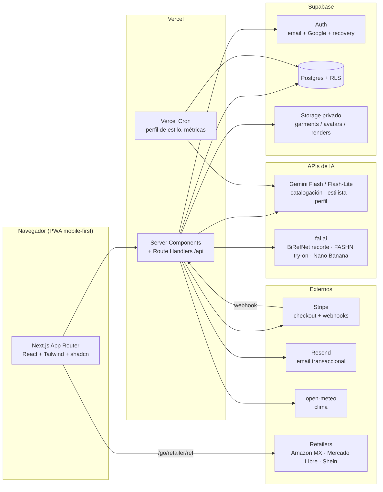

# ClosetAI — Documento Maestro del Proyecto

**Versión 1.3 — 19 de agosto de 2026**
**Fuente única de verdad del proyecto. Todo lo que contradiga este documento está mal, salvo que Tamara diga lo contrario.**

---

## 0. Cómo usar este documento (léelo primero, Claude)

Este documento está escrito para ti: un Claude (Code) recién instalado en una computadora nueva, sin ningún contexto previo. Fue producido tras una fase de investigación y decisiones con Tamara, titular del proyecto. Tu misión es ejecutarlo de principio a fin.

Reglas de operación:

1. **No vuelvas a preguntar nada que ya esté decidido aquí.** Las decisiones de negocio están tomadas y justificadas. Si surge algo genuinamente nuevo que solo la titularidad puede decidir, pregúntale a Tamara.
2. **Los pasos marcados 🔑 TAMARA son de Tamara.** Tú nunca creas cuentas, nunca tecleas contraseñas ni datos de pago, nunca aceptas términos y condiciones en su nombre. Prepara todo hasta ese punto, pide el paso, y continúa cuando te entregue las credenciales/API keys por el canal que decida (normalmente el archivo `.env.local`).
3. **La evidencia de la rúbrica se genera desde el día uno como subproducto del trabajo** (ver §7). No es una tarea de última hora: cada sesión de trabajo alimenta los logs.
4. **Idioma:** el producto, el código de cara al usuario y la comunicación con Tamara son en español (es-MX). El código interno (nombres de variables, commits) en inglés, como es estándar.
5. **Cadencia:** trabaja en fases (§6). Cada fase termina con deploy funcionando en producción. Nunca dejes la rama principal rota.
6. **Este archivo vive en el repo** como `docs/DOCUMENTO-MAESTRO.md` desde el primer commit. Si una decisión cambia con aprobación de Tamara, actualiza este documento en el mismo PR.

---

## 1. Resumen ejecutivo

**ClosetAI** (closetai.lat) es una aplicación web comercial: un **estilista personal con inteligencia artificial**. El usuario fotografía su ropa, construye su clóset digital, y la IA le genera outfits, se los muestra puestos sobre su propia foto (try-on fotorrealista), aprende sus gustos con cada interacción y le recomienda qué prendas comprar para completar su estilo — monetizando esas recomendaciones con afiliados.

### Decisiones ya tomadas (no reabrir)

| Decisión | Valor | Racional corto |
|---|---|---|
| Nombre y dominio | **ClosetAI / closetai.lat** | Registrado 19-ago-2026 en Namecheap. Nombre descriptivo: dice qué hace el producto sin explicarlo. Ver riesgo de colisión de marca en §9 |
| Plazo | **&lt; 1 mes** hasta versión evaluable | Deadline académico; ver rúbrica §7 |
| Presupuesto | **Mínimo posible; free tiers siempre que se pueda** | Único gasto variable inevitable: renders de try-on |
| Cuentas | **Nuevas, dedicadas al proyecto** | Negocio separado de los demás negocios de Tamara |
| Modelo de negocio | **Freemium + pago único $100 MXN + créditos de try-on** | Detalle en §2.3. El clóset es gratis para siempre; nunca se paywallea trabajo ya invertido |
| Mercado inicial | **México, español, mobile-first web** | Hueco real: no existe jugador nativo es-MX/LATAM |
| Filosofía técnica | **Comprar, no construir** | 1 mes de plazo: APIs comerciales probadas, cero entrenamiento propio |
| Stack | Next.js + Supabase + Vercel + Stripe + Gemini + fal.ai (FASHN) + Resend | Detalle y justificación en §4 |
| Avatar | **Foto real del usuario como base del try-on** (no avatar 3D) | Estándar 2026; máxima identidad, costo cero de creación |

### Estado al 19-ago-2026

- Investigación de mercado, competencia, APIs de try-on y afiliados: **completada** (síntesis en §2, fuentes en Apéndice D).
- Dominio closetai.lat: **registrado** 19-ago-2026 (Namecheap, privacidad WHOIS incluida).
- Código: **cero líneas**. Todo empieza con este documento.

---

## 2. Contexto de negocio

### 2.1 Titularidad

Tamara Muñoz Delgadillo (tamaramunozdel@gmail.com). Titular del proyecto: toma todas las decisiones de negocio y opera personalmente la computadora donde tú corres. ClosetAI es un negocio propio y separado: cuentas, facturación y repo dedicados, nunca mezclados con nada más.

### 2.2 Mercado y competencia (síntesis de investigación, ago-2026)

**El mercado está validado y capitalizado:** Whering (clóset digital, UK) tiene 10M de usuarios y levantó capital de eBay Ventures y Google AI Futures Fund en jul-2026. Doji levantó $14M USD (Thrive), Alta $11M (Menlo + familia Arnault), Daydream $50M, Phia $35M. Google integró try-on gratis en Search/Shopping (disponible en México) y cerró su app Doppl en abr-2026.

**El hueco:** no existe ningún jugador nativo en español/LATAM. Whering y Alta apenas traducen la tienda. Chicisimo (el único gigante hispano) murió en 2020 sin monetizar. Nadie atiende tallas/marcas/precios/ocasiones de México, y nadie usa el ángulo de presupuesto ("maximiza combinaciones con lo que ya tienes") que en LATAM pega más que el framing europeo de sostenibilidad.

**Las 5 quejas que destruyen apps de esta categoría** — ClosetAI se diseña explícitamente contra ellas:

| # | Queja (evidencia) | Antídoto de diseño en ClosetAI |
|---|---|---|
| 1 | Fricción de fotografiar todo el clóset — causa #1 de abandono (Stylebook: 6-8 h/100 prendas) | Captura por lotes: varias prendas por foto, IA separa y cataloga; onboarding pide solo 10 prendas para dar valor el día 1 |
| 2 | Paywall retroactivo sobre el clóset ya catalogado (Acloset: años de trabajo tras un paywall de €130/año) | **El clóset es gratis e ilimitado para siempre.** Se cobra por servicios encima (estilista completo, try-on), jamás por acceder a tus datos |
| 3 | Crashes, lentitud, recorte de fondo malo (Whering) | Stack simple y probado; recorte con BiRefNet + edición manual de respaldo; presupuesto de performance en CI |
| 4 | La IA decepciona: outfits genéricos, avatares que no se parecen al usuario (Doji llegó a cambiar la raza del usuario) | Try-on con modelo especializado en fidelidad (FASHN), captura guiada de foto base, expectativas honestas en la UI |
| 5 | Publicidad invasiva y conflicto de interés de afiliados | Cero ads. Relevancia primero en recomendaciones; el afiliado desempata, nunca decide. Divulgación clara de links de afiliado |

**Precios que funcionan / fracasan en la categoría:** freemium generoso funciona (Whering); pago único barato tiene demanda explícita y longevidad (Stylebook: 17 años a $4.99 USD); "gratis con afiliados" es la apuesta VC no probada; free con ads agresivos + premium caro fracasa (Pureple); dark patterns de cobro destruyen reputación (Style DNA). Style DNA demuestra que el nicho monetiza sin capital: ~$3M USD/año, 70K suscriptores, bootstrapped.

### 2.3 Modelo de negocio (decidido)

| Tier | Precio | Incluye | Costo variable para nosotros |
|---|---|---|---|
| **Gratis** | $0 | Clóset ilimitado con catalogación IA, 3 outfits IA/día, 1 try-on de muestra | ~$0.01 USD/usuario/mes (catalogación ≈ $0.0003/prenda; outfits con free tier de Gemini) |
| **ClosetAI Completo** | **$100 MXN, una sola vez** | Estilista IA ilimitado, avatar, **30 créditos** de try-on, análisis de qué te falta + recomendaciones de compra | Acotado: 30 créditos ≈ $2.25 USD máximo |
| **Recarga de créditos** | $49 MXN / 20 créditos | 20 renders de try-on | ~$1.50 USD → margen positivo tras comisión Stripe |

- **1 crédito = 1 render de try-on** (FASHN, ~$0.075 USD). El "modo explorar" (visualización rápida de looks, menor fidelidad, Nano Banana ~$0.039) cuesta 0.5 créditos (se cobra 1 crédito por cada 2 usos).
- Números de referencia: $100 MXN ≈ $5.3 USD; Stripe MX cobra 3.6% + $3 MXN + IVA ≈ $7.2 MXN por transacción; neto ≈ $92.8 MXN ≈ $4.9 USD; costo máximo comprometido por venta ≈ $2.25 USD → margen bruto ≥ 50% incluso si el usuario quema todos sus créditos.
- **Afiliados** (capa secundaria, madura con el tiempo): Amazon Afiliados MX paga **10% en moda** (alta inmediata, cookie 24 h); Mercado Libre tiene programa activo (moda ~8-15%, paga a Mercado Pago); Shein vía Admitad (10-20%). Ingreso realista al inicio: ~$2 MXN/usuario activo/mes — su valor temprano es el **dato de intención** (qué clican, qué compran) y desbloquear APIs (Amazon Creators API requiere 10 ventas/30 días). Estrategia completa en §3.4.7 y Apéndice D.

### 2.4 Contexto académico

El proyecto se presenta también como entregable de un curso con rúbrica (imágenes en la carpeta `Rubriuca` del Desktop de la máquina original; transcrita íntegra en §7). **La rúbrica es el piso, no el techo:** se cumple al 100% por diseño del proceso, y el producto debe quedar muy por encima. La rúbrica prescribe Vercel + Supabase + GitHub + agente de código con log de prompts — exactamente el stack elegido, así que no hay tensión entre lo académico y lo profesional.

---

## 3. Producto

### 3.1 Usuario objetivo

Núcleo: mujeres y hombres de 18–35 en México, urbanos, compran ropa online (ticket promedio moda online MX: ~$1,300 MXN), viven en el celular, hablan español. La app es **web mobile-first** (PWA instalable): en LATAM ~85% es Android y una web app evita las dos tiendas, cumple la rúbrica (URL viva) y permite iterar a diario.

### 3.2 Principios de producto

1. **Valor en 10 minutos:** el onboarding entrega un outfit útil con solo ~10 prendas catalogadas.
2. **Tu clóset es tuyo:** gratis, ilimitado, exportable, borrable. Para siempre.
3. **Honestidad de IA:** nunca prometemos magia; el try-on se presenta como "así se vería" con foto base guiada.
4. **El estilista no es vendedor:** primero resuelve con lo que ya tienes; recomienda comprar solo lo que de verdad falta.
5. **Aprende de todo:** cada aceptación, rechazo, comentario, favorito y uso real alimenta el perfil de estilo.
6. **Privacidad seria:** fotos de cuerpo = dato sensible; buckets privados, URLs firmadas, borrado real, aviso de privacidad LFPDPPP.

### 3.3 Módulos y criterios de aceptación

Cada módulo lista sus criterios de aceptación (CA) — son los tests de aceptación de la rúbrica.

**M1. Cuentas y perfil**
- Registro con email+contraseña y con Google (Supabase Auth). Verificación por correo (Resend).
- CA: registro → correo de confirmación llega → login → sesión persiste; recuperación de contraseña end-to-end; editar nombre, foto, tallas (superior/inferior/calzado), ciudad (para clima), preferencias declaradas (estilos que ama/odia, colores vetados, partes del cuerpo que prefiere resaltar/cubrir); borrar cuenta elimina datos y fotos (verificable en Storage).

**M2. Clóset digital**
- Subida de fotos por lote (drag&drop / cámara móvil), compresión client-side a WebP ≤300KB.
- Pipeline por prenda: recorte de fondo (BiRefNet en fal.ai) → catalogación IA (Gemini, salida JSON: categoría, subcategoría, colores, patrón, material aparente, estilo, temporada, ocasiones, notas) → usuario confirma/corrige en una pantalla de revisión rápida.
- Vista clóset: grid con filtros (categoría, color, temporada, ocasión), búsqueda, detalle de prenda, editar/archivar/eliminar.
- CA: subir 5 fotos en lote → 5 prendas catalogadas y recortadas en &lt;60 s; corrección manual persiste y alimenta el perfil (feedback `tag_fix`); prenda eliminada desaparece de Storage.

**M3. Estilista IA (outfits)**
- "¿Qué me pongo hoy?": genera 3 outfits desde el clóset real del usuario considerando ocasión, clima de su ciudad (API open-meteo, gratis), perfil de estilo y feedback histórico. Explica *por qué* funciona cada outfit (teoría de color, proporciones, ocasión) — esto educa al usuario (objetivo "aprender qué le favorece").
- Acciones por outfit: aceptar (lo uso hoy), rechazar (con motivo opcional de 1 tap: "no me gusta la combinación / no es mi estilo / no aplica al clima/ocasión"), comentar en texto libre, guardar como favorito, marcar "lo usé".
- Chat estilista (usuarios de pago): conversación libre con contexto del clóset y perfil ("¿qué me pongo para una boda en la playa?").
- CA: generar outfit &lt;15 s; cada acción crea `feedback_event`; outfit referencia solo prendas existentes del usuario; explicación presente en cada outfit.

**M4. Aprendizaje de gustos (el moat)**
- `style_profile` JSON por usuario (ver Apéndice A3): preferencias inferidas con evidencia y confianza, actualizado por un LLM tras cada lote de eventos (trigger: cada 5 eventos o 24 h, lo que ocurra primero — job en Vercel Cron).
- El perfil alimenta cada prompt del estilista. La UI lo expone en "Tu estilo" (transparencia): "He aprendido que prefieres monocromáticos, evitas amarillo, amas streetwear" con opción de corregir cada inferencia (más feedback).
- CA: tras 5 rechazos consecutivos de un mismo color/estilo, el estilista deja de proponerlo (test reproducible); pantalla "Tu estilo" refleja inferencias y permite corregirlas.

**M5. Avatar y try-on**
- Onboarding de avatar (pago): captura guiada de 1-3 fotos de cuerpo entero (instrucciones de luz/pose/fondo, validación con Gemini visión de que la foto sirve).
- Try-on: outfit o prenda → render fotorrealista sobre la foto base (FASHN v1.6 vía fal.ai, 1 crédito). Modo explorar: render rápido de looks (Nano Banana, 0.5 créditos). Galería de renders guardados; compartir imagen.
- Contador de créditos siempre visible; compra de recargas in-app.
- CA: render en &lt;30 s con spinner y estado; débito de crédito atómico (ledger) exactamente al éxito del render; sin créditos → CTA de recarga, nunca error crudo; foto base rechazada da explicación accionable ("se ve borrosa, toma otra con más luz").

**M6. Recomendaciones de compra (gap analysis + afiliados)**
- "Qué le falta a tu clóset": análisis IA (mensual o bajo demanda) de huecos reales: básicos ausentes, colores que combinarían con N prendas, ocasiones sin cobertura. Cada recomendación explica el porqué y cuántos outfits nuevos desbloquearía.
- Por cada prenda recomendada: búsqueda de productos comprables en México (Amazon MX, Mercado Libre, Shein) con precio y talla del usuario, enlazados vía **link resolver propio** `/go/[retailer]/[ref]` que registra el clic y aplica el tag de afiliado si existe (conmutabale por retailer sin redeploy).
- Divulgación visible: "ClosetAI puede ganar comisión si compras por estos enlaces."
- CA: gap analysis produce ≥3 recomendaciones con justificación; cada clic saliente queda en `affiliate_clicks`; los enlaces de Amazon llevan `?tag=` del proyecto.

**M7. Pagos y créditos**
- Stripe Checkout: pago único $100 MXN (product `closetai_lifetime`) y recargas $49 MXN (product `credits_20`). Webhook `checkout.session.completed` → activa plan / abona créditos en `credit_ledger`. **Toda sesión de Checkout lleva `metadata.user_id`** (regla dura: un pago sin metadata es dinero invisible — no hay forma de saber a quién abonarle).
- CA: compra de prueba (modo test) activa el plan y abona 30 créditos; webhook idempotente (reintento de Stripe no duplica créditos); pantalla de éxito/cancelación; historial de compras en el perfil.

**M8. Panel admin (mínimo pero real)**
- Ruta `/admin` (allowlist de emails vía env): métricas del día (usuarios, prendas, outfits generados, renders, créditos vendidos/quemados, gasto estimado de APIs), lista de usuarios, botón de abonar créditos manualmente (soporte), kill-switch de try-on (env/flag) si el gasto se descontrola.
- CA: gasto estimado del día visible; kill-switch apaga try-on con mensaje amable al usuario.

### 3.4 Fuera de alcance del primer mes (backlog priorizado post-lanzamiento)

1. Onboarding por video del clóset (walkthrough → IA segmenta prendas) — el diferenciador #1 detectado; hacerlo en cuanto haya usuarios.
2. Estilista por WhatsApp ("¿qué me pongo hoy?" con foto) — canal natural en México.
3. Feeds de producto Admitad/Awin (Shein, Liverpool, Coppel) + Amazon Creators API (requiere 10 ventas/30 días).
4. Reventa/segunda mano (GoTrendier, Mercado Libre) — lección de Chicisimo.
5. pgvector para similitud visual de prendas y "compra parecidos".
6. Planeador semanal + calendario, packing lists de viaje.
7. Social: compartir outfits, estilar a amigas.
8. English / expansión LATAM.

---

## 4. Arquitectura técnica

### 4.1 Stack (tabla de decisión)

| Capa | Elección | Free tier | Justificación / alternativa considerada |
|---|---|---|---|
| Framework | **Next.js 15+ (App Router) + TypeScript** | — | SSR+API en un repo, primera clase en Vercel (rúbrica). Alt: Remix — sin ventaja aquí |
| UI | **Tailwind CSS v4 + shadcn/ui** | — | Velocidad y calidad visual con 1 desarrollador-agente |
| Hosting | **Vercel** | Hobby $0 | Prescrito por rúbrica. ⚠️ Hobby es no-comercial: al cobrar dinero real, subir a Pro ($20/mes). Durante desarrollo/evaluación, Hobby |
| BD + Auth + Storage | **Supabase** (Postgres) | $0 (500MB DB, 1GB storage, 50K MAU auth) | Prescrito por rúbrica y además la mejor opción: auth completa (email+OAuth+recovery), RLS, Storage con URLs firmadas. ⚠️ free tier pausa proyectos tras ~1 semana de inactividad — durante desarrollo no pasa; configurar ping semanal después |
| Pagos | **Stripe MX** | $0 fijo (3.6%+$3+IVA por tx) | Estándar; Checkout + webhooks. Alt: Mercado Pago — considerar como 2º método más adelante (público sin tarjeta) |
| Email transaccional | **Resend** | $0 (3,000/mes, 100/día) | Verificación, recovery, recibos. Dominio closetai.lat verificado + SMTP custom en Supabase Auth |
| IA — catalogación visión | **Gemini 2.5 Flash-Lite** (API key de Google AI Studio) | Free tier generoso; pagado ≈ $0.0003/prenda | El más barato con calidad suficiente y JSON estructurado. ⚠️ Google lo retira ~oct-2026: el código usa un **adapter** (`lib/ai/`) con el modelo en env var — migrar al sucesor es cambiar una línea. Alt: Claude Haiku 4.5 (~$0.004/prenda), mejor si se prefiere un solo proveedor |
| IA — estilista/chat/perfil | **Gemini 2.5 Flash** | Free tier | Razonamiento suficiente + costo ~cero al inicio. El adapter permite subir a Claude Sonnet si la calidad del estilista lo amerita |
| IA — recorte de fondo | **BiRefNet v2 en fal.ai** | ~$0.001/imagen | SOTA open source; mismo proveedor que try-on (una sola cuenta/key) |
| IA — try-on | **FASHN v1.6 vía fal.ai** ($0.075/render) | pay-as-you-go | El especialista: preserva estampados/logos (fidelidad no negociable), 7-19 s, licencia comercial. Plan B: Amazon Nova Canvas ($0.04-0.08) o fal image-apps-v2 ($0.04). ❌ Evitar IDM-VTON/CatVTON/OOTDiffusion: licencia no comercial |
| IA — modo explorar | **Gemini 2.5 Flash Image "Nano Banana"** ($0.039) | — | Looks estilizados baratos; NO para el "ver en mí" final (no garantiza fidelidad de prenda) |
| Clima | **open-meteo.com** | $0, sin key | Para outfits por clima |
| Shopping search | Links de búsqueda con tag de afiliado (fase 1); **DataForSEO Merchant API** (~$0.002/query) cuando se necesite catálogo estructurado | — | SerpAPI free 250/mes como alternativa de arranque |
| Tests | **Vitest** (unit) + **Playwright** (e2e) | $0 | Rúbrica exige ≥3 tests/semana con evidencia |
| CI | **GitHub Actions** | $0 | lint + typecheck + tests en cada PR |
| Observabilidad | **Sentry** (free) + Vercel Analytics + tabla `api_costs` propia | $0 | El costo de APIs se registra en BD y se ve en /admin |
| Repo | **GitHub** — repo `closetai` en cuenta/org nueva | $0 | Rúbrica: commits como evidencia |
| DNS/registro | **Namecheap** para closetai.lat ($2 USD el 1er año, renueva ~$41 USD/año) | — | Único gasto fijo obligado. DNS puede vivir en Vercel. ⚠️ El precio de renovación es 20× el de entrada: anotar la fecha |

**Costo fijo total del primer mes: ~$2 USD (dominio) + depósito inicial ~$10 USD en fal.ai.** Todo lo demás en $0 hasta tener usuarios de pago.

### 4.2 Diagrama de arquitectura



**Flujo de datos crítico (try-on):** UI pide render → route handler valida sesión + créditos (RLS + ledger) → firma URLs de foto base y prenda → llama FASHN → guarda resultado en Storage → debita crédito en `credit_ledger` (transacción) → registra costo en `api_costs` → devuelve URL firmada. Todo server-side; **las API keys jamás tocan el cliente.**

### 4.3 Modelo de datos

Esquema completo con SQL y políticas RLS en **Apéndice B**. Resumen de tablas:

| Tabla | Propósito |
|---|---|
| `profiles` | 1:1 con auth.users — nombre, tallas, ciudad, plan (`free`/`lifetime`), onboarding |
| `garments` | Prendas: rutas de imagen original y recortada, atributos IA (categoría, colores[], patrón, material, estilos[], temporadas[], ocasiones[]), `ai_meta` jsonb, estado |
| `outfits` + `outfit_items` | Outfits generados o manuales, con explicación de la IA, ocasión, rating |
| `feedback_events` | **El corazón del aprendizaje**: type (`accept`/`reject`/`comment`/`favorite`/`wear`/`tag_fix`/`rec_click`...), payload jsonb |
| `style_profiles` | Perfil inferido jsonb versionado (Apéndice A3) |
| `avatar_photos` | Fotos base del usuario, con estado de validación |
| `tryon_renders` | Renders: prendas usadas, proveedor, créditos, ruta, estado |
| `credit_ledger` | Movimientos de créditos (compra/consumo/abono admin), saldo = SUM(delta). Nunca se edita, solo se inserta |
| `purchases` | Compras Stripe: session_id, product, monto, estado |
| `shopping_recs` | Resultados de gap analysis + productos sugeridos |
| `affiliate_clicks` | Clics salientes: retailer, url, usuario, prenda recomendada |
| `api_costs` | Registro de cada llamada facturable (proveedor, operación, costo estimado USD) |

Reglas duras: **RLS activada en el 100% de las tablas desde su creación** (toda tabla nueva nace con RLS y política owner-only; las de admin, service-role only). Buckets de Storage **privados**; acceso solo por URL firmada de TTL corto generada server-side.

### 4.4 Seguridad, privacidad y cumplimiento

- Fotos de cuerpo y clóset = **datos personales sensibles**: aviso de privacidad (LFPDPPP México) en `/privacidad` + checkbox de consentimiento explícito en registro y otro específico al subir foto de cuerpo; derechos ARCO vía correo del proyecto; borrado de cuenta purga BD **y** Storage.
- Moderación de subida: validación con Gemini visión (rechazar desnudos/menores/contenido que no sea ropa o foto de cuerpo vestido).
- Rate limits por usuario en endpoints de IA (p. ej. 30 catalogaciones/hora, 10 outfits/día free) — tabla `rate_limits` o Upstash Redis free si se prefiere.
- **Control de gasto**: env `MAX_DAILY_API_SPEND_USD` (default 5). Job de cron suma `api_costs` del día; si excede, activa kill-switch de try-on y avisa por email a Tamara. Ningún usuario puede gastar más créditos de los que su ledger permite (transacción atómica).
- Secretos solo en `.env.local` (git-ignored) y en Vercel env vars. Nunca en el repo, nunca en el cliente, nunca en logs.
- Cabeceras de seguridad (CSP, HSTS) vía `next.config`; dependencias auditadas en CI (`pnpm audit`).

---

## 5. Setup de la computadora nueva (ejecutar en orden)

### 5.0 Software base (lo instala Claude; la contraseña de admin que pida el instalador la teclea Tamara, nunca Claude)

```bash
# 1. Homebrew (si no existe)
/bin/bash -c "$(curl -fsSL https://raw.githubusercontent.com/Homebrew/install/HEAD/install.sh)"
# 2. Herramientas
brew install git gh node pnpm supabase/tap/supabase stripe/stripe-cli/stripe vercel-cli
# (alternativa node: brew install fnm && fnm install --lts)
# 3. Verificar
git --version && node --version && pnpm --version && gh --version && supabase --version && stripe --version && vercel --version
```

### 5.1 Cuentas 🔑 TAMARA (en este orden; Claude prepara y espera)

> Regla: Tamara crea cada cuenta con el **correo del proyecto** (paso 1) y guarda las credenciales en su gestor de contraseñas. A Claude solo se le entregan **API keys** vía `.env.local`, nunca contraseñas.

1. **Correo del proyecto**: ✅ ya existe (creado cuando el proyecto se llamaba Vestia; se reutiliza tal cual — el nombre del buzón es irrelevante, nadie lo ve). Todas las cuentas siguientes se registran con este correo. Debe tener teléfono y correo de recuperación configurados: es la llave maestra del negocio.
2. **Dominio**: ✅ **closetai.lat registrado** en Namecheap el 19-ago-2026 ($2 USD el 1er año; renueva ~$41 USD/año, auto-renew activado). Siguiente: delegar DNS a Vercel o gestionarlo en el registrar (Claude dará los registros exactos).
3. **GitHub**: cuenta nueva (u org `closetai-app`); crear repo privado `closetai`; invitar como colaborador la cuenta que usará Claude o configurar `gh auth login` (Tamara teclea el código de dispositivo).
4. **Vercel**: cuenta con el correo del proyecto; conectar el repo `closetai`.
5. **Supabase**: cuenta + proyecto `closetai-prod` (región `us-east-1` o la más cercana disponible). Entregar a Claude: URL, anon key, service role key.
6. **Stripe**: cuenta MX (requiere datos fiscales y cuenta bancaria de Tamara; puede empezar en modo test sin activar). Entregar keys test y, cuando active, live.
7. **Resend**: cuenta; agregar dominio closetai.lat (Claude dará los registros DNS a capturar). Entregar API key.
8. **Google AI Studio** (aistudio.google.com): generar API key de Gemini con el correo del proyecto. Gratis.
9. **fal.ai**: cuenta + depósito inicial ~$10 USD (🔑 el pago lo hace Tamara). Entregar FAL_KEY.
10. **Sentry**: cuenta free, proyecto `closetai`. Entregar DSN.
11. **Amazon Afiliados MX** (afiliados.amazon.com.mx): alta con la URL closetai.lat cuando ya esté deployada (semana 3-4). Anotar el tag (`closetai-20` o similar).
12. **Mercado Libre Afiliados** (mercadolibre.com.mx/landing/afiliados): alta con cuenta ML + Mercado Pago del proyecto. *(Admitad y Awin: post-lanzamiento.)*

### 5.2 Variables de entorno (`.env.local` — plantilla completa)

```bash
# App
NEXT_PUBLIC_APP_URL=https://closetai.lat
ADMIN_EMAILS=tamaramunozdel@gmail.com,closetai.lat@gmail.com   # correo personal + correo del proyecto

# Supabase
NEXT_PUBLIC_SUPABASE_URL=
NEXT_PUBLIC_SUPABASE_ANON_KEY=
SUPABASE_SERVICE_ROLE_KEY=

# Stripe
NEXT_PUBLIC_STRIPE_PUBLISHABLE_KEY=
STRIPE_SECRET_KEY=
STRIPE_WEBHOOK_SECRET=
STRIPE_PRICE_LIFETIME=      # price id de $100 MXN
STRIPE_PRICE_CREDITS_20=    # price id de $49 MXN

# IA
GEMINI_API_KEY=
GEMINI_MODEL_VISION=gemini-2.5-flash-lite   # migrar al sucesor cuando Google lo retire (~oct-2026)
GEMINI_MODEL_REASONING=gemini-2.5-flash
GEMINI_MODEL_IMAGE=gemini-2.5-flash-image
ANTHROPIC_API_KEY=          # opcional: adapter alterno (claude-haiku-4-5-20251001)
FAL_KEY=

# Email
RESEND_API_KEY=
EMAIL_FROM="ClosetAI <hola@closetai.lat>"

# Afiliados
AMAZON_AFFILIATE_TAG=       # cuando exista (p. ej. closetai-20)

# Operación
MAX_DAILY_API_SPEND_USD=5
TRYON_KILL_SWITCH=false
CRON_SECRET=                # generar: openssl rand -hex 24

# Observabilidad
SENTRY_DSN=
```

Espejo en Vercel: `vercel env` (o dashboard). Nunca commitear este archivo.

### 5.3 Estructura del repo

```
closetai/
├── docs/
│   ├── DOCUMENTO-MAESTRO.md        # este archivo (commit #1)
│   └── evidencia/                  # rúbrica, ver §7
│       ├── PROMPT_LOG.md
│       ├── TEST_EVIDENCE.md
│       ├── ITERATION_LOG.md
│       ├── DECISION_NOTES.md
│       └── demos/                  # videos semanales
├── src/
│   ├── app/                        # App Router: (auth), (app), admin, api/
│   ├── components/
│   ├── lib/
│   │   ├── ai/                     # adapter LLM (gemini.ts, anthropic.ts, prompts/)
│   │   ├── fal.ts                  # recorte + try-on + nano banana
│   │   ├── stripe.ts
│   │   ├── supabase/               # clients server/browser, tipos generados
│   │   └── credits.ts              # ledger transaccional
│   └── tests/                      # vitest
├── e2e/                            # playwright
├── supabase/
│   └── migrations/                 # SQL versionado (Apéndice B)
└── .github/workflows/ci.yml
```

Convenciones: rama `main` protegida deployable siempre; ramas `feat/*`, `fix/*`; commits convencionales en inglés (`feat: garment batch upload`), frecuentes (la rúbrica cuenta commits); PR aunque trabaje solo el agente (self-review = evidencia de juicio).

---

## 6. Plan de ejecución — 4 semanas

> Cada semana cierra con: feature funcionando en producción, ≥5 commits, ≥2 deploys, ≥5 prompts en PROMPT_LOG, ≥3 tests con evidencia, entrada en ITERATION_LOG (qué cambió tras probar), DECISION_NOTE de 150-250 palabras, y video demo de 2-3 min (guion: problema → feature en vivo → qué sigue). El video lo graba Tamara con guion escrito por Claude.

**Semana 0 (días 1-2) — Build Discipline Packet (ANTES de codificar, exige la rúbrica):**
setup de máquina (§5.0), cuentas core 🔑 (§5.1 pasos 1-10), repo con este documento como commit #1, **mockups generados por imagen** (Nano Banana / Gemini Image: 5-6 pantallas clave — landing, clóset, outfit del día, try-on, paywall — guardados en `docs/evidencia/mockups/` con nota de implementación y recortes de alcance), spec y criterios de aceptación (§3.3) revisados, migración SQL inicial, deploy "hello ClosetAI" a Vercel con dominio conectado. *Con esto, las categorías 1-4 de la rúbrica (4.5 pts) quedan cubiertas antes de la primera línea de producto.*

**Semana 1 — Clóset (M1 + M2):** auth completa (registro, login, Google, recovery con Resend), perfil, subida por lotes, pipeline recorte+catalogación, revisión/corrección, vista clóset con filtros. Deploy continuo. Demo: "de fotos a clóset digital en 2 minutos".

**Semana 2 — Estilista (M3 + M4):** outfit del día ×3 con clima y explicación, acciones de feedback, perfil de estilo con cron y pantalla "Tu estilo", chat estilista. Demo: "la IA que aprende que odias el amarillo".

**Semana 3 — Avatar + dinero (M5 + M7):** captura guiada de foto base con validación, try-on FASHN + modo explorar, galería, créditos con ledger, Stripe Checkout ($100 y recargas) con webhook idempotente, paywall honesto. Demo: "así te ves con tu propio outfit + compra en vivo (modo test)".

**Semana 4 — Compras + blindaje (M6 + M8 + calidad):** gap analysis, recomendaciones con link resolver y tags de afiliado (altas 🔑 11-12), panel admin con costos y kill-switch, Sentry, rate limits, aviso de privacidad y borrado de cuenta, suite e2e completa de los CA de §3.3, pulido visual mobile, video final de 5 min. **Activación de Stripe live 🔑 y decisión de subir Vercel a Pro cuando haya venta real.**

Gestión de riesgo del plazo: si la semana 3 se atrasa, el modo explorar (Nano Banana) se recorta primero; el try-on FASHN nunca — es la promesa central. Si FASHN da problemas de calidad con fotos reales de usuarios, cambiar a Nova Canvas es 1 día de trabajo (adapter).

---

## 7. Rúbrica — transcripción y mapeo (cumplimiento por diseño)

Rúbrica de 10 pts. Cómo la cubre el proceso:

| Categoría (pts) | Evidencia exigida | Dónde se cumple en ClosetAI |
|---|---|---|
| Build discipline before coding (1.5) | Problema, usuario, spec, UX, arquitectura, stack, DevOps, plan de pruebas antes de codificar | **Este documento** + Semana 0 completa antes de la primera línea de producto |
| UX planning & image-generated mockup (1.0) | Mockup/wireframe + nota de implementación + recorte de alcance | `docs/evidencia/mockups/` (Semana 0, generados con IA de imagen) |
| Product spec & acceptance criteria (1.0) | Requisitos y CA claros y testeables | §3.3 — cada módulo con CA que son literalmente los tests e2e |
| Architecture & stack clarity (1.0) | Sketch de arquitectura + tabla de stack | §4.1 tabla + §4.2 diagrama y flujo de datos |
| Working deployed product (2.0) | URL viva y feature semanal funcionando | closetai.lat en Vercel desde Semana 0; cadencia semanal §6 |
| Coding/build evidence (1.0) | ≥5 commits, ≥2 deploys, log de prompts del agente | Convención de commits frecuentes + `PROMPT_LOG.md` alimentado cada sesión |
| Testing & iteration (1.0) | Tests mínimos + ≥1 mejora derivada | Vitest+Playwright (≥3/semana) + `ITERATION_LOG.md` |
| Human judgment & explanation (1.0) | Explicar decisiones, rechazos, correcciones, tradeoffs | `DECISION_NOTES.md`: nota semanal de 150-250 palabras que **Tamara revisa y firma** (es su voz, no la del agente) |
| Demo clarity (0.5) | Demo en vivo que prueba el feature | Video semanal 2-3 min; final (Week 6) 5 min, con guion |

Checklist de evidencia exigida: Live URL (Vercel/dominio propio ✓), Build Discipline Packet ✓, UX mockup generado por imagen ✓, Product Spec ✓, Architecture Sketch ✓, GitHub ≥5 commits ✓, Vercel ≥2 deployments ✓, **Supabase evidence** (capturas de tablas con datos reales — tomarlas al cierre de cada semana) ✓, Codex/Claude prompt log ≥5 ✓, Test evidence ≥3 ✓, Iteration log ✓, Demo video ✓, Human Decision Note ✓.

**Cómo se excede el piso:** la rúbrica pide una página viva con features semanales; ClosetAI entrega un producto comercial completo con pagos reales, IA multimodal (visión + generación + razonamiento), sistema de aprendizaje continuo, monetización por afiliados, panel de operación con control de costos, seguridad RLS al 100% y cumplimiento de privacidad mexicano.

---

## 8. Presupuesto

| Concepto | Costo | Cuándo |
|---|---|---|
| Dominio closetai.lat | $2 USD el 1er año (renueva ~$41 USD/año) | Semana 0 🔑 ✅ |
| Depósito fal.ai (recorte + try-on) | $10 USD (dura ~130 renders o ~10,000 recortes) | Semana 0 🔑 |
| Vercel, Supabase, Resend, Gemini, Sentry, GitHub, Stripe (fijo), open-meteo | **$0** | free tiers |
| **Total mes 1** | **~$12 USD** | dominio $2 + depósito fal.ai $10 |
| Al vender de verdad: Vercel Pro $20/mes; Supabase Pro $25/mes cuando 1GB storage se agote (~5-8K prendas) | ~$45 USD/mes | pagado por ingresos |

Unit economics recordatorio: venta de $100 MXN deja ~$92.8 netos ≈ $4.9 USD contra costo máximo comprometido $2.25 USD (30 créditos) → margen ≥50% en el peor caso; catalogación y outfits cuestan centavos y se regalan.

## 9. Riesgos y mitigaciones

| Riesgo | Prob. | Mitigación |
|---|---|---|
| Try-on decepciona con fotos caseras (queja #4 de la categoría) | Media | Captura guiada + validación de foto; expectativas honestas; fallback Nova Canvas; premium Try-On Max si se justifica |
| Retiro de Gemini 2.5 Flash-Lite (~oct-2026) | Certeza | Adapter con modelo en env var; migración = 1 línea |
| Gasto de API descontrolado | Baja (créditos) | Ledger atómico, `MAX_DAILY_API_SPEND_USD`, kill-switch, tabla `api_costs` visible en /admin |
| ToS de Vercel Hobby (uso comercial) | Media | Subir a Pro con la primera venta real ($20/mes ya pagados por margen) |
| Stripe MX tarda en activar cuenta | Media | Alta 🔑 en Semana 0; construir todo en modo test |
| Supabase free pausa por inactividad | Baja en dev | Cron semanal de ping post-lanzamiento o upgrade |
| Amazon Afiliados cierra cuenta sin 3 ventas en 180 días | Media | Es re-aplicable; ML+Admitad como alternas; el link resolver conmuta sin redeploy |
| Scope creep con 1 mes de plazo | Alta | Fases cerradas §6; recortes predefinidos; backlog §3.4 para todo lo demás |
| Colisión de marca: «ClosetAI» es descriptivo y se parece a Acloset (§2.2) y a otras apps de la categoría | Media | Verificar IMPI antes de invertir en identidad visual; el nombre es fácil de cambiar mientras no haya usuarios; el dominio costó $2 |

---

## Apéndice A — Prompts de sistema (base; iterar y versionar en `lib/ai/prompts/`)

### A1. Catalogación de prenda (visión → JSON)

```
Eres el catalogador de ClosetAI. Analiza la foto de una prenda de ropa y devuelve SOLO JSON válido con este esquema:
{ "categoria": "top|bottom|vestido|abrigo|calzado|accesorio|bolsa|otro",
  "subcategoria": "string es-MX (ej. 'playera', 'jeans skinny', 'blazer')",
  "colores": ["1-3 colores dominantes en es-MX"],
  "patron": "liso|rayas|cuadros|floral|estampado|animal print|otro",
  "material_aparente": "string",
  "estilos": ["1-3 de: casual, formal, streetwear, deportivo, elegante, boho, minimalista, romántico, edgy"],
  "temporadas": ["primavera|verano|otoño|invierno|todo el año"],
  "ocasiones": ["diario","oficina","fiesta","cita","deporte","playa","evento formal"],
  "notas_styling": "1 frase útil para combinar",
  "confianza": 0.0-1.0 }
Si la imagen no es una prenda (o es contenido inapropiado), devuelve {"error": "motivo"}.
```

### A2. Estilista (generación de outfits)

```
Eres ClosetAI, estilista personal experto en teoría de color, proporciones y moda mexicana actual. SOLO puedes usar prendas del clóset proporcionado (referéncialas por id).
Contexto: [PERFIL_DE_ESTILO], [CLIMA], [OCASION], [FEEDBACK_RECIENTE].
Genera 3 outfits distintos. Por cada uno: prendas (ids), por qué funciona (color/proporción/ocasión, 2-3 frases, tono cálido y directo es-MX, sin tecnicismos vacíos), y un tip para elevarlo.
Respeta SIEMPRE: colores vetados, estilos odiados y prendas archivadas. Si el clóset no alcanza para la ocasión, dilo honestamente y sugiere qué falta (alimenta gap analysis). Devuelve JSON según esquema.
```

### A3. Actualizador de perfil de estilo (el moat)

```
Eres el motor de aprendizaje de ClosetAI. Recibes el perfil actual (JSON) y los eventos nuevos de feedback. Devuelve el perfil actualizado:
{ "estilos_preferidos": [{"valor","confianza",„evidencia"}],
  "estilos_rechazados": [...], "colores_favoritos": [...], "colores_vetados": [...],
  "combinaciones_exitosas": [...], "prendas_favoritas": [ids], "siluetas": {...},
  "ocasiones_frecuentes": [...], "notas_libres": "aprendizajes no estructurados",
  "version": n+1 }
Reglas: la evidencia manda (no inventes); sube confianza con repetición, bájala con contradicción; un comentario textual pesa más que un tap; nunca borres una inferencia con confianza > 0.8, márcala en revisión. Máximo 40 entradas totales: conserva las de mayor confianza.
```

### A4. Gap analysis (recomendaciones de compra)

```
Eres el asesor de compras de ClosetAI. Con el clóset completo, el perfil de estilo y las ocasiones frecuentes del usuario, detecta 3-5 huecos REALES: básicos ausentes, colores puente que multiplicarían combinaciones, ocasiones sin cobertura. Por cada hueco: prenda concreta (con color y estilo), por qué, y cuántos outfits nuevos habilitaría con prendas existentes (lista ids). Sé conservador: recomendar de más destruye confianza. JSON según esquema.
```

## Apéndice B — Esquema SQL inicial (migración 001; ejecutar vía `supabase migration`)

```sql
-- Extensiones
create extension if not exists "pgcrypto";

create table profiles (
  id uuid primary key references auth.users on delete cascade,
  display_name text, avatar_url text, city text default 'Ciudad de México',
  size_top text, size_bottom text, size_shoes text,
  plan text not null default 'free' check (plan in ('free','lifetime')),
  gender_presentation text, onboarding_done boolean default false,
  created_at timestamptz default now()
);

create table garments (
  id uuid primary key default gen_random_uuid(),
  user_id uuid not null references profiles(id) on delete cascade,
  image_path text not null, clean_image_path text,
  category text, subcategory text, colors text[] default '{}',
  pattern text, material text, styles text[] default '{}',
  seasons text[] default '{}', occasions text[] default '{}',
  ai_meta jsonb default '{}'::jsonb, styling_note text,
  status text not null default 'active' check (status in ('active','archived','processing','failed')),
  created_at timestamptz default now()
);

create table outfits (
  id uuid primary key default gen_random_uuid(),
  user_id uuid not null references profiles(id) on delete cascade,
  title text, occasion text, weather jsonb, explanation text,
  source text not null default 'ai' check (source in ('ai','manual')),
  status text default 'suggested' check (status in ('suggested','accepted','rejected','favorite','worn')),
  created_at timestamptz default now()
);
create table outfit_items (
  outfit_id uuid references outfits(id) on delete cascade,
  garment_id uuid references garments(id) on delete cascade,
  slot text, primary key (outfit_id, garment_id)
);

create table feedback_events (
  id bigint generated always as identity primary key,
  user_id uuid not null references profiles(id) on delete cascade,
  type text not null check (type in ('accept','reject','comment','favorite','wear','tag_fix','rec_click','profile_fix')),
  outfit_id uuid references outfits(id) on delete set null,
  garment_id uuid references garments(id) on delete set null,
  payload jsonb default '{}'::jsonb, processed boolean default false,
  created_at timestamptz default now()
);

create table style_profiles (
  user_id uuid primary key references profiles(id) on delete cascade,
  profile jsonb not null default '{}'::jsonb,
  version int not null default 0, updated_at timestamptz default now()
);

create table avatar_photos (
  id uuid primary key default gen_random_uuid(),
  user_id uuid not null references profiles(id) on delete cascade,
  image_path text not null, is_primary boolean default false,
  validation text default 'pending' check (validation in ('pending','ok','rejected')),
  validation_note text, created_at timestamptz default now()
);

create table tryon_renders (
  id uuid primary key default gen_random_uuid(),
  user_id uuid not null references profiles(id) on delete cascade,
  outfit_id uuid references outfits(id) on delete set null,
  garment_ids uuid[] not null, avatar_photo_id uuid references avatar_photos(id),
  provider text not null, mode text not null default 'tryon' check (mode in ('tryon','explore')),
  credits_charged numeric(4,1) not null, image_path text,
  status text default 'processing' check (status in ('processing','done','failed')),
  created_at timestamptz default now()
);

create table credit_ledger (
  id bigint generated always as identity primary key,
  user_id uuid not null references profiles(id) on delete cascade,
  delta numeric(6,1) not null, reason text not null,
  ref text, created_at timestamptz default now()
);
create index on credit_ledger (user_id);

create table purchases (
  id uuid primary key default gen_random_uuid(),
  user_id uuid not null references profiles(id) on delete cascade,
  stripe_session_id text unique not null, product text not null,
  amount_mxn int not null, status text default 'pending',
  created_at timestamptz default now()
);

create table shopping_recs (
  id uuid primary key default gen_random_uuid(),
  user_id uuid not null references profiles(id) on delete cascade,
  gap jsonb not null, products jsonb default '[]'::jsonb,
  created_at timestamptz default now()
);

create table affiliate_clicks (
  id bigint generated always as identity primary key,
  user_id uuid references profiles(id) on delete set null,
  retailer text not null, target_url text not null,
  rec_id uuid references shopping_recs(id) on delete set null,
  created_at timestamptz default now()
);

create table api_costs (
  id bigint generated always as identity primary key,
  user_id uuid, provider text not null, operation text not null,
  est_cost_usd numeric(8,5) not null, created_at timestamptz default now()
);

-- RLS: TODA tabla la activa; owner-only para tablas de usuario
alter table profiles enable row level security;
alter table garments enable row level security;
alter table outfits enable row level security;
alter table outfit_items enable row level security;
alter table feedback_events enable row level security;
alter table style_profiles enable row level security;
alter table avatar_photos enable row level security;
alter table tryon_renders enable row level security;
alter table credit_ledger enable row level security;
alter table purchases enable row level security;
alter table shopping_recs enable row level security;
alter table affiliate_clicks enable row level security;
alter table api_costs enable row level security;

create policy "own profile" on profiles for all using (auth.uid() = id);
create policy "own garments" on garments for all using (auth.uid() = user_id);
create policy "own outfits" on outfits for all using (auth.uid() = user_id);
create policy "own outfit_items" on outfit_items for all
  using (exists (select 1 from outfits o where o.id = outfit_id and o.user_id = auth.uid()));
create policy "own feedback" on feedback_events for all using (auth.uid() = user_id);
create policy "own style" on style_profiles for select using (auth.uid() = user_id);
create policy "own avatar" on avatar_photos for all using (auth.uid() = user_id);
create policy "own renders" on tryon_renders for select using (auth.uid() = user_id);
create policy "own ledger" on credit_ledger for select using (auth.uid() = user_id);
create policy "own purchases" on purchases for select using (auth.uid() = user_id);
create policy "own recs" on shopping_recs for select using (auth.uid() = user_id);
-- Escrituras de renders/ledger/purchases/style/recs/api_costs/affiliate_clicks: solo service role (server).
-- Storage: buckets privados 'garments', 'avatars', 'renders'; políticas por carpeta user_id; URLs firmadas TTL 15 min.
```

## Apéndice C — Marca y tono (inicial; Tamara aprueba antes del lanzamiento público)

- **ClosetAI** — se escribe en una palabra, sin acento y sin espacio, igual que el dominio.
  En el copy, «clóset» como sustantivo común sí lleva acento: la marca es ClosetAI, el mueble es tu clóset.
- Tono: estilista amiga experta — cálida, directa, honesta, cero jerga técnica, es-MX neutro (tuteo). Nunca body-shaming: el estilo se adapta al cuerpo, no al revés.
- Tagline de trabajo: **"Tu estilista, en tu bolsillo."**
- UI: mobile-first, mucha foto y poco texto, dark mode desde el día 1.

## Apéndice D — Fuentes clave de la investigación (ago-2026)

- Try-on: fashn.ai/pricing · docs.fashn.ai · fal.ai/models (FASHN v1.6, Kling Kolors $0.07, BiRefNet, Leffa) · aws.amazon.com/bedrock/pricing (Nova Canvas VTO $0.04-0.08) · docs.cloud.google.com Vertex `virtual-try-on-001` (GA ene-2026) · developers.googleblog.com (Gemini 2.5 Flash Image $0.039). ⚠️ IDM-VTON/CatVTON/OOTDiffusion: licencias CC BY-NC, no usar comercialmente.
- Catalogación: ai.google.dev/gemini-api/docs/pricing (Flash-Lite $0.10/$0.40 por Mtok) · ximilar.com/pricing (descartado: 10-30× más caro) · remove.bg (descartado: 100×+ más caro que BiRefNet).
- Competencia: tech.eu (Whering $7M, 10M usuarios, jul-2026) · techcrunch.com (Doji $14M; Alta $11M) · jetstream.blog (cierre Doppl abr-2026) · oreateai.com (caso paywall Acloset) · starterstory.com (Style DNA $3M/año bootstrapped) · modaes.com (cierre Chicisimo).
- Afiliados MX: afiliados.amazon.com.mx (10% moda; Creators API requiere 10 ventas/30 días; PA-API murió may-2026) · mercadolibre.com.mx/landing/afiliados · admitad.com (Shein, Coppel) · awin.com (Liverpool) · blog.rakutenadvertising.com (Rakuten migra a impact.com) · ShopStyle Collective cerró 2026 · blog.elogia.net + blog.amvo.org.mx (mercado moda online MX).

---

*Fin del documento. Siguiente acción del Claude que lo lea: §0, luego §5.0.*

---

## Historial de cambios

**v1.3 — 19-ago-2026.** **El proyecto se llama ClosetAI y vive en closetai.lat.** Antes se
llamaba Vestia. Decisión de Tamara al comprar el dominio. Se renombró todo: documento, app,
repositorio (`~/closetai`), paquete, prompts de IA, landing, plantilla de entorno, CI y runbook
de cuentas. Cambian también los identificadores operativos: producto de Stripe
`closetai_lifetime`, proyecto de Supabase `closetai-prod`, tag de afiliado `closetai-20`, correo
del proyecto `closetai.lat@gmail.com`. **Riesgo nuevo registrado en §9:** el nombre es genérico
y se parece a Acloset, competidor citado en §2.2 — hay que verificar disponibilidad de marca
antes de invertir en identidad visual.

**v1.2 — 19-ago-2026.** Se eligió TLD `.lat` sobre `.mx` (el proyecto todavía se llamaba
Vestia). Se advirtió el tradeoff antes de confirmar: el precio de entrada de `.lat` ($1.80 +
$0.20 de ICANN) es promocional y renueva a ~$41 USD/año, prácticamente lo mismo que `.mx`, así
que el ahorro es solo del primer año. Tamara decidió `.lat`, que además encaja con la expansión
a LATAM del backlog (§3.4). Presupuesto del mes 1 baja de ~$55 a ~$12 USD.


**v1.1 — 19-ago-2026.** (Proyecto aún llamado Vestia.) Se corrige la titularidad: la dueña es **Tamara Muñoz
Delgadillo** (tamaramunozdel@gmail.com), quien opera la máquina y hace los pasos 🔑. Se
actualizan §2.1, §5.1, §5.2 (`ADMIN_EMAILS`), §7 (firma de notas de decisión) y todas las
marcas 🔑. Se retiran dos afirmaciones que ya no aplican (otros negocios en M7 y
§3.4). Sin cambios en producto, stack, modelo de negocio ni plan.

**v1.0 — 19-ago-2026.** Documento original, bajo el nombre Vestia.
